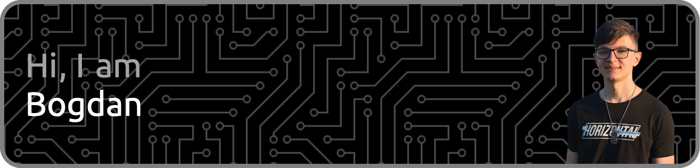

  
  
  
  

# 👋 Hi, I'm Bogdan Velicu

I'm a passionate computer science student at the University of Bucharest, currently in my 20s. With a solid foundation in software development and a focus on front-end and mobile app development, I'm dedicated to honing my skills and contributing to innovative projects. I took part in many projects as a full stack software engineer developing both modern, stylish frontends and responsive, efficient backends. On this page you can view some of my personal accomplishments.

  <b>Here are some of the tech stacks I mostly work with:</b>
  

## 🚀 About Me

- 🎓 **Education:** Pursuing a Computer Science degree at the University of Bucharest.
- 🌱 **Experience:** Over 5 years of hands-on experience in software development.
- 💼 **Skills:** Proficient in JavaScript, C#, HTML/CSS, C/C++, Python, and React Native.
- 🔍 **Interests:** Keen interest in exploring and mastering emerging technologies.

## 📊 GitHub Stats

## 👨‍🎓 Personal Projects

## 🏢 4GPS Projects (private)

## 📈 Visitors

## 📞 Contact

📧 **Email:** [bboodd24@gmail.com](mailto:bboodd24@gmail.com)

Feel free to reach out for collaboration, job opportunities, or just to connect!
